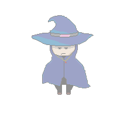

<html>
  <head>
    <title>Swedishsailor</title>
  </head>
    <body>
    <h1> Swedishsailor Unity Game Developer</h1>
      <h3> 22 years old, psychology and technology lover, PixelArt psycho D:</h3>
      <h1> Some footage :3 </h1>
   <h2> >Salve Devito< </h2>
     <a class="button" img src="sorcerer.png" href="SalveDevito">Button</a>
      
      
 MMO RPG game - own world, own story. Choose your character's class, get your weapon and 

      <h2> DimensionEye </h2>
      
 2D "platformer" game, the main domain in this game is to find as many eyes as you can. You are blind Jack but any eye you've found can be used in certain ways

      <h2> PixelArt </h2>
###Contact:
kzygowski7@gmail.com
